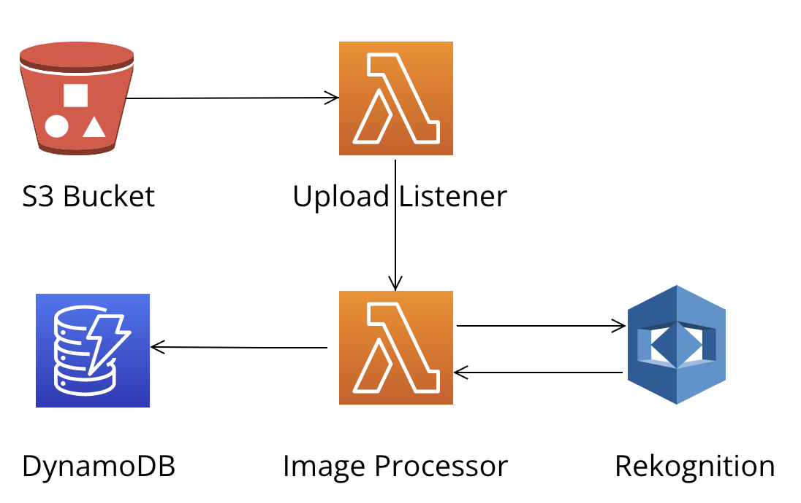

# aws-event-driven-architecture-example

## Description

This code that accompanies my blog article called [Event-Driven Development on AWS: Node.js, Python, and CloudFormation](https://swm.cc/articles/event-driven-architecture).

Event-driven architecture is a popular software design pattern that allows you to create more flexible, scalable, and resilient applications. With [AWS](https://aws.amazon.com/), you can easily implement event-driven development using a variety of services and tools.

In this example, I explore how to build an event-driven application on AWS using [Node.js](htts://nodejs.org), [Python](https://www.python.org), [CloudFormation](https://aws.amazon.com/cloudformation/).

## Development Information

The code given hasn't been tested or executed. In some cases the code has yet to be completed. There are outstanding [issues](https://github.com/swmcc/aws-event-driven-architecture-example/issues) to help get the code to a deployable state. Please contribute if you want to.
